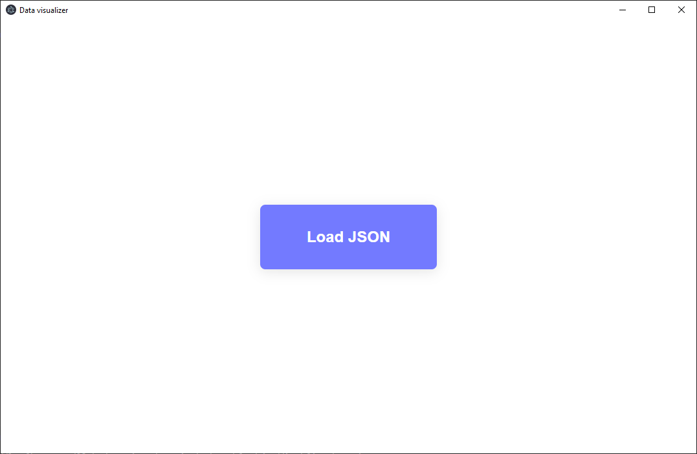
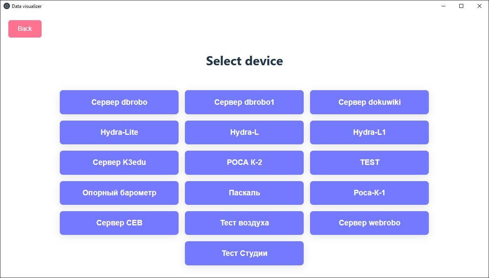
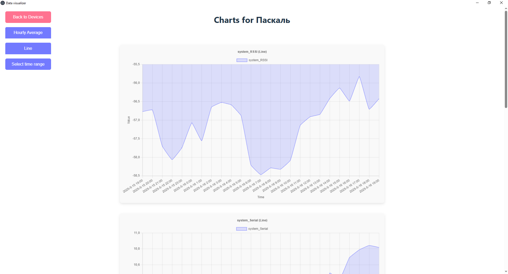
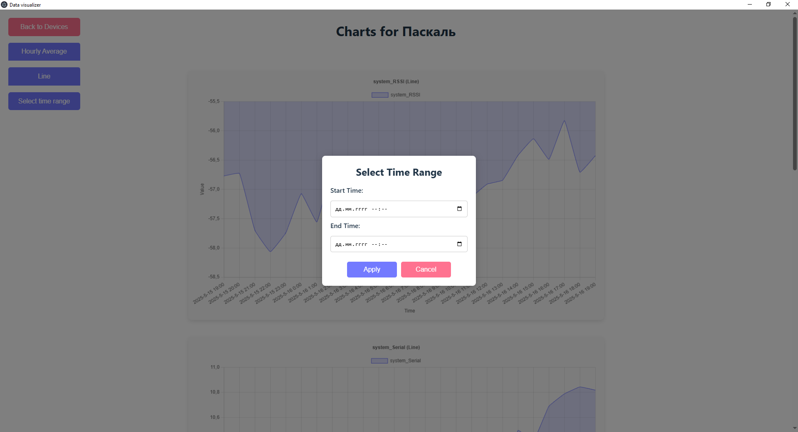

## Data Visualizer

A cross-platform Electron application for visualizing data from JSON files using Chart.js.

## Prerequisites

* Node.js [https://nodejs.org]
* Git [https://git-scm.com]
* Npm (included with Node.js)

## Installation

1. Clone the repository:

```bash
git clone https://github.com/wasseks/Practice.git
cd Practice
```

2. Install dependencies:

```bash
npm install
```

## To run the project

### Building in development

to run from local server 
```bash
npm run dev // runs vite server
npm run electron
```
to run from local files
```bash
npm run build // builds .js and .css files for electron
npm run electron
```

### Building for productuion

To get .exe file(Windows), .AppImage(linux), .dmg(macOS)
```bash
npm run build-app
```
## Dependencies

- Node.js
- Vite
- Electron  
- Charts.js
- Chromium (google chrome engine)

## Usage

1. Launch the app using npm start or yarn start.
2. Click the "Load JSON" button to select a JSON file.
3. Choose a device to view its data visualized with Chart.js.

### initial Page



### devices Page



### charts Page



### modal Window to select time range


